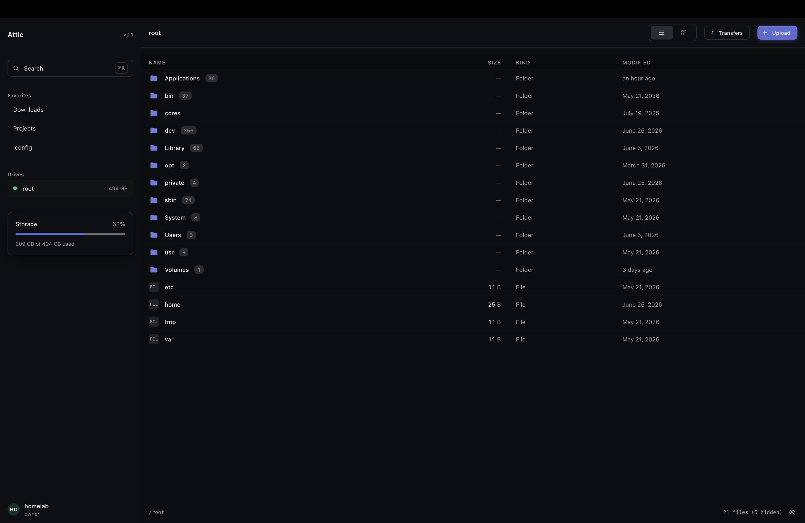
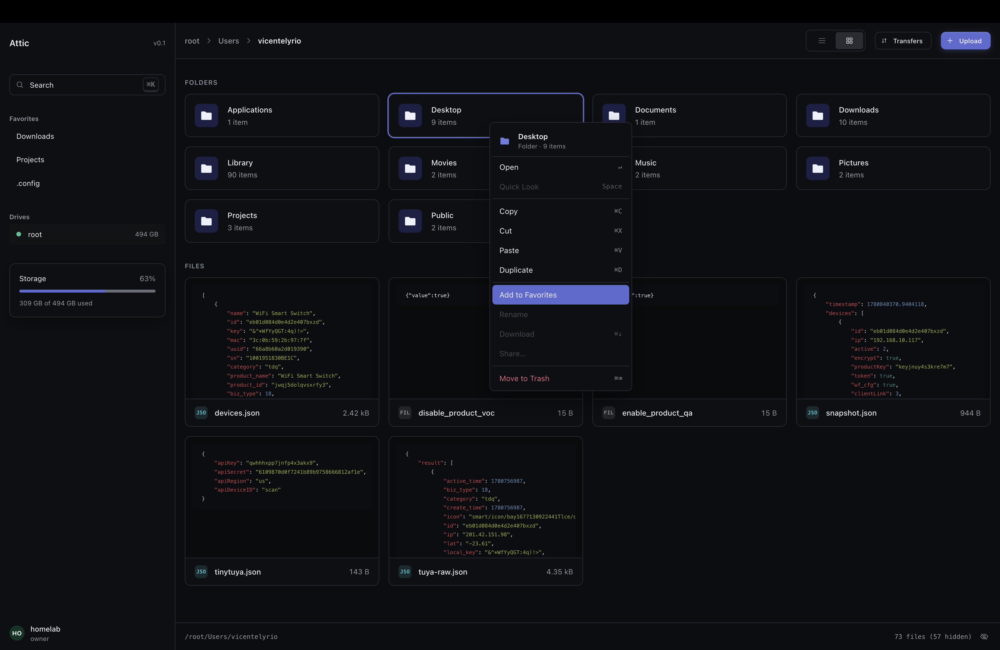
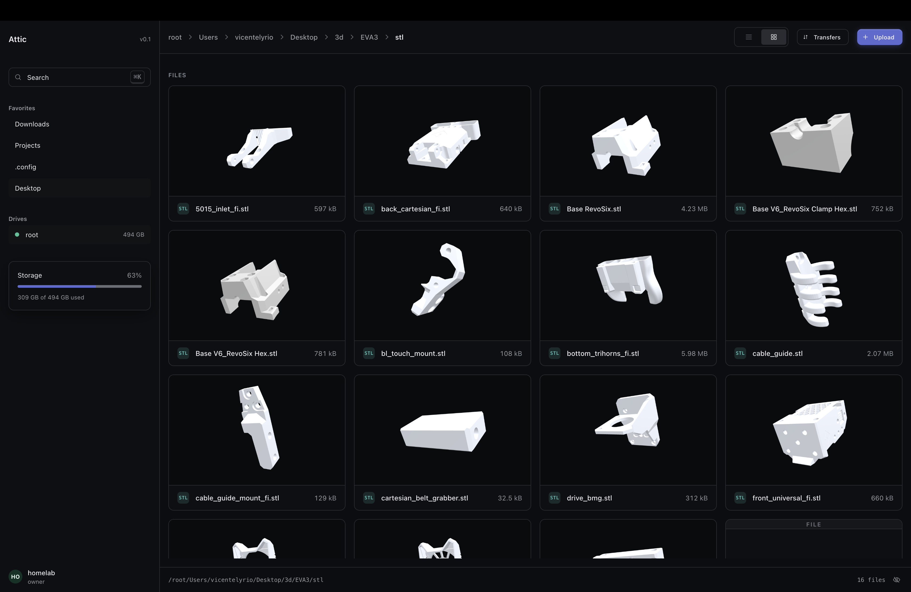

# Attic

A self-hosted file vault: a single Rust binary that serves both the HTTP API and
the React web UI (the built SPA is embedded into the binary), backed by SQLite.

## Screenshots

Browse your roots in a dense list view, with favorites, drives, and storage in
the sidebar:



A grid view with per-file context actions — favorite, copy, move, download, and
more:



Rendered 3D thumbnails for STL and other model files:



## Self-hosting with Docker (recommended)

The image bundles everything. You only need Docker and a password hash.

1. Generate an owner password hash:

   ```bash
   docker run --rm -it ghcr.io/vicentelyrio/attic hash-password
   ```

2. Put it in a `.env` file next to `docker-compose.yml`:

   ```
   VAULT_OWNER_PASSWORD_HASH='<paste the hash>'
   ```

3. Point Attic at the files you want to browse. Each directory you mount under
   `/data/roots` in `docker-compose.yml` becomes a drive in the UI, named after
   the folder. Add a line per drive (skip this to use a fresh `files` drive):

   ```yaml
   - /mnt/tank/media:/data/roots/media
   - /mnt/tank/photos:/data/roots/photos
   ```

4. Start it:

   ```bash
   docker compose up -d
   ```

The UI is at http://localhost:4000. Your drives are whatever you mounted under
`/data/roots`, and the database lives in `./data/attic.db`. Sign in as `admin`
with the password you hashed.

To override defaults (listen address, upload cap, `roots_dir`, `secure_cookies`),
mount your own config over `/app/config.toml`, or point `CONFIG_PATH` at another
file.

> Set `secure_cookies = true` once you serve over HTTPS (e.g. behind a
> TLS-terminating reverse proxy).

## Self-hosting with the prebuilt binary

Each tagged release attaches a static Linux binary. Download it, drop a
`config.toml` next to it (see the committed `config.toml` for the shape), set
`VAULT_OWNER_PASSWORD_HASH`, and run `./attic`. Generate a hash with
`./attic hash-password`. Override the config location with `CONFIG_PATH`.

## Building from source

```bash
# 1. Build the SPA (the Rust build embeds web/dist at compile time)
pnpm -C web install
pnpm -C web build

# 2. Build the binary
cargo build --release   # -> target/release/attic
```

Run the two-process dev setup instead with `cargo run` (backend on :4000) and
`pnpm -C web dev` (Vite proxies `/api` to the backend).

## Releases & CI

- `.github/workflows/ci.yml` runs on push/PR: frontend typecheck + build, and
  backend clippy + tests.
- `.github/workflows/release.yml` runs on a `v*` tag: builds and pushes the
  Docker image to GHCR and attaches a static Linux binary to the GitHub release.

Cut a release with:

```bash
git tag v0.1.0 && git push origin v0.1.0
```
