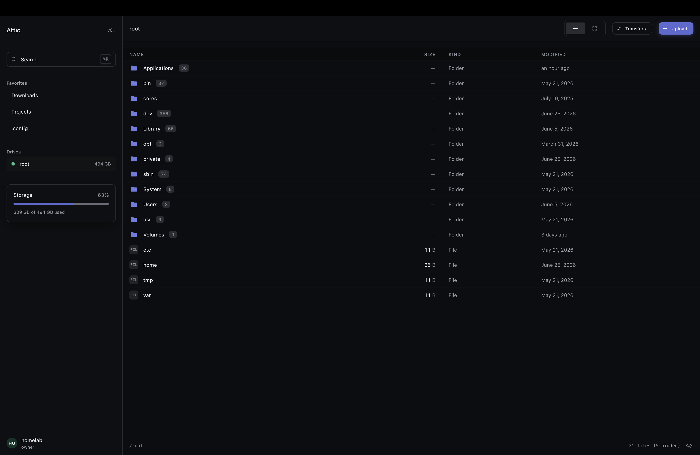
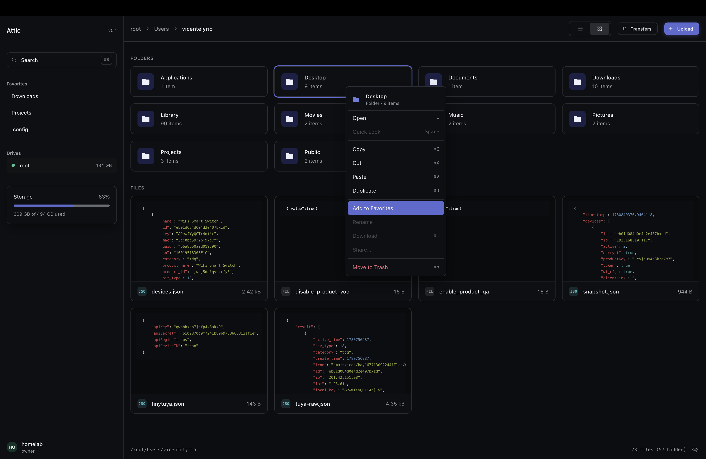
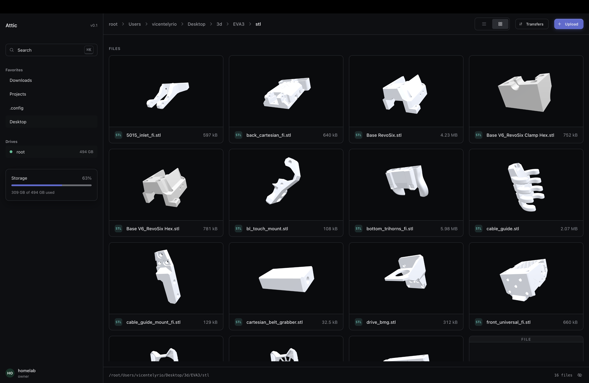

# Attic

A self-hosted file vault: a single Rust binary that serves both the HTTP API and
the React web UI (the built SPA is embedded into the binary), backed by SQLite.

## Screenshots

Browse your roots in a dense list view, with favorites, drives, and storage in
the sidebar:



A grid view with per-file context actions — favorite, copy, move, download, and
more:



Rendered 3D thumbnails for STL and other model files:



## Self-hosting with Docker (recommended)

The image bundles everything. You only need Docker and a password hash.

1. Generate an owner password hash:

   ```bash
   docker run --rm -it ghcr.io/vicentelyrio/attic hash-password
   ```

2. Put it in a `.env` file next to `docker-compose.yml`:

   ```
   VAULT_OWNER_PASSWORD_HASH='<paste the hash>'
   ```

3. Point Attic at the files you want to browse. Each directory you mount under
   `/data/roots` in `docker-compose.yml` becomes a drive in the UI, named after
   the folder. Add a line per drive (skip this to use a fresh `files` drive):

   ```yaml
   - /mnt/tank/media:/data/roots/media
   - /mnt/tank/photos:/data/roots/photos
   ```

4. Start it:

   ```bash
   docker compose up -d
   ```

The UI is at http://localhost:4000. Your drives are whatever you mounted under
`/data/roots`, and the database lives in `./data/attic.db`. Sign in as `admin`
with the password you hashed.

To override defaults (listen address, upload cap, `roots_dir`, `secure_cookies`),
mount your own config over `/app/config.toml`, or point `CONFIG_PATH` at another
file.

> **If you mount your own `config.toml`, start from `docker/config.toml`, not
> the `config.toml` in the repo root.** The root one is the local dev config,
> and three of its values break a container: `listen = "127.0.0.1:4000"` makes
> the published port unreachable, `db_path = "attic.db"` writes the database
> inside the container where it is lost on every recreate, and
> `roots_dir = "./roots"` resolves to `/app/roots` rather than `/data/roots`,
> so no drives are found. Whatever you set for `roots_dir` must match where you
> mount the drives.

> Set `secure_cookies = true` once you serve over HTTPS (e.g. behind a
> TLS-terminating reverse proxy).

## Self-hosting with the prebuilt binary

Each tagged release attaches a static Linux binary. Download it, drop a
`config.toml` next to it (see the committed `config.toml` for the shape), set
`VAULT_OWNER_PASSWORD_HASH`, and run `./attic`. Generate a hash with
`./attic hash-password`. Override the config location with `CONFIG_PATH`.

## Troubleshooting

Attic logs at INFO by default. Set `RUST_LOG=attic=debug,tower_http=debug` to
have failures reported with the request's method and URI attached.

**No drives in the UI, or every action fails with 503.** The server found
nothing under `roots_dir`. On startup it logs one line per drive:

```
INFO attic::state: root 'media' -> /data/roots/media
```

If you instead see `no drives found under roots_dir '...'`, that path doesn't
match where the drives are mounted — compare the volume lines in
`docker-compose.yml` against `roots_dir`. A 503 means the server is
misconfigured; a 403 means the path itself was rejected.

**Folder actions are greyed out with a "read-only" badge.** The UI mirrors an
`access(W_OK)` check on the directory, so this is the OS refusing writes, not
an Attic permission model. Find the real error in the log — it names the path
and the errno:

```bash
docker compose logs attic | grep failed
```

`Read-only file system` usually means a failed mount or a filesystem the kernel
remounted read-only after errors (check `dmesg` and `/proc/mdstat`).
`Permission denied` means the uid the server runs as can't write there: either
run the container as the uid that owns the files (`user: "1000:1000"` in
`docker-compose.yml`, plus `chown` the `./data` directory to match), or adjust
ownership on the host.

**Running inside an unprivileged LXC container** (Proxmox and similar) needs an
extra step, because uid 0 in the container maps to host uid 100000. Bind-mounted
storage owned by a host uid outside the container's mapped range shows up as
`nobody:nogroup` and is unwritable even by root — writes fail while browsing
still works. Map the owning uid into the container (`lxc.idmap`, plus a matching
entry in `/etc/subuid` and `/etc/subgid`) rather than chowning the storage,
which would break anything else sharing those disks.

## Building from source

```bash
# 1. Build the SPA (the Rust build embeds web/dist at compile time)
pnpm -C web install
pnpm -C web build

# 2. Build the binary
cargo build --release   # -> target/release/attic
```

Run the two-process dev setup instead with `cargo run` (backend on :4000) and
`pnpm -C web dev` (Vite proxies `/api` to the backend).

## Releases & CI

- `.github/workflows/ci.yml` runs on push/PR: frontend typecheck + build, and
  backend clippy + tests.
- `.github/workflows/release.yml` runs on a `v*` tag: builds and pushes the
  Docker image to GHCR and attaches a static Linux binary to the GitHub release.

Cut a release with:

```bash
git tag v0.1.0 && git push origin v0.1.0
```
